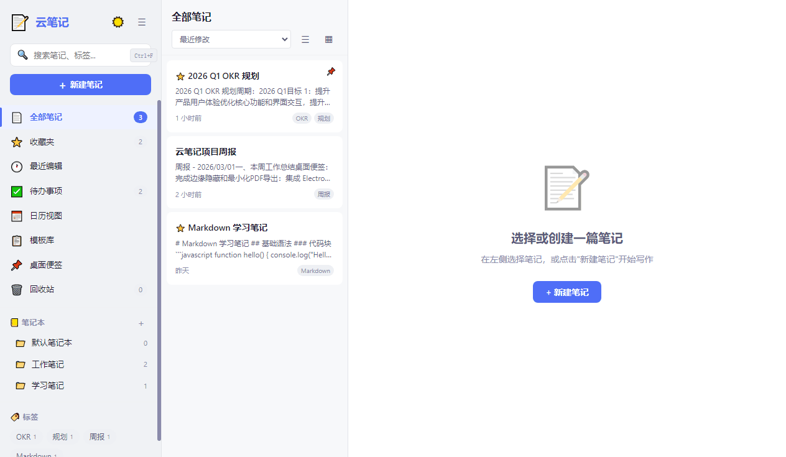
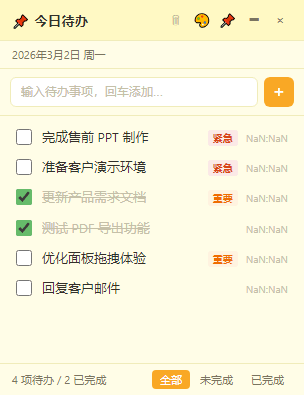

# 云笔记 (CloudNotes)

> 智能高效的桌面笔记解决方案 — 基于 Electron，数据完全本地化，零框架依赖。


## 特性

- **双引擎编辑** — 富文本（所见即所得）+ Markdown（实时预览），自由切换
- **数据本地化** — 所有数据存储在本地 localStorage，不经过任何云服务器
- **桌面便签** — 独立透明窗口，6 种主题配色，支持待办事项与优先级标记
- **多格式导出** — PDF / HTML / Markdown / JSON / 纯文本，一键导出
- **极速启动** — 原生 HTML/CSS/JS，零框架依赖，冷启动 < 2 秒
- **亮暗主题** — 一键切换明暗主题，面板自由拖拽缩放

## 截图

### 主题切换



### 桌面便签



## 技术栈

| 技术 | 说明 |
|------|------|
| Electron v33 | 桌面应用框架 |
| 原生 HTML/CSS/JS | 零框架、零构建、源码即运行 |
| marked.js | Markdown 解析渲染 |
| highlight.js | 代码语法高亮 |
| KaTeX | LaTeX 数学公式渲染 |
| electron-builder | 打包为 Windows 安装包 |

## 快速开始

### 环境要求

- Node.js >= 18
- npm >= 9

### 安装与运行

```bash
# 克隆仓库
git clone https://github.com/xbwang1988/note-assist.git
cd note-assist

# 安装依赖
npm install

# 启动应用
npm start
```

### 打包

```bash
# NSIS 安装包
npm run build

# 便携版
npm run build:portable
```

产出在 `dist/` 目录下。

## 项目结构

```
note-assist/
├── main/                # 主进程模块
│   ├── index.js         # 入口：GPU 配置 + 模块组装 + 生命周期
│   ├── window-main.js   # 主窗口管理
│   ├── window-sticky.js # 便签窗口 + 边缘隐藏
│   ├── tray.js          # 系统托盘
│   ├── menu.js          # 应用菜单
│   ├── ipc.js           # IPC 通信处理
│   └── app-icon.js      # 图标工具
├── preload/             # 预加载脚本（安全 IPC 桥接）
├── renderer/            # 主窗口渲染进程
│   ├── index.html       # 主窗口页面
│   ├── js/              # 17 个 JS 模块（Prototype Mixin 模式）
│   └── css/             # 13 个语义化 CSS 模块
├── sticky/              # 桌面便签（独立窗口）
│   ├── sticky.html
│   ├── js/sticky.js
│   └── css/sticky.css
├── vendor/              # 第三方库（本地化，不依赖 CDN）
├── assets/              # 应用图标
├── docs/                # 项目文档（PRD、开发规范、工作流记录）
├── tools/               # 工具脚本（截图、GIF 合成、PPT 生成）
└── package.json
```

## 功能清单

### 笔记管理
- 多级笔记本（树形目录）
- 标签分类与标签云
- 全文搜索（标题 + 正文 + 标签）
- 置顶、收藏、回收站
- 历史版本管理（自动保存，最多 50 个版本）

### 编辑器
- 富文本：加粗/斜体/标题/列表/表格/代码块/公式/图片
- Markdown：GFM 语法、代码高亮、双栏预览、数学公式
- 9 种内置模板（会议纪要、周报、OKR、日记等）

### 桌面便签
- 无边框透明窗口
- 待办事项增删改查
- 优先级标记（`!!` 高 / `!` 中 / 默认低）
- 拖拽排序、边缘自动隐藏
- 6 种主题（浅黄、蓝、绿、粉、紫、暗色）

### 其他
- 日历视图（按日期查看笔记）
- 5 种格式导出 + 全量数据备份/恢复
- 系统托盘驻留
- 快捷键支持
- 面板拖拽缩放

## 文档

- [产品需求文档 (PRD)](docs/note-prd.md)
- [开发工作流记录](docs/workflow-log.md)
- [开发规范](docs/development-standard.md)
- [开发计划](docs/development-plan.md)

## License

[MIT](LICENSE)
